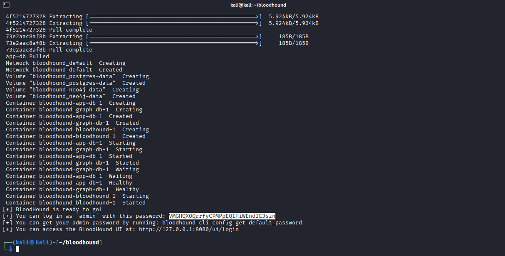
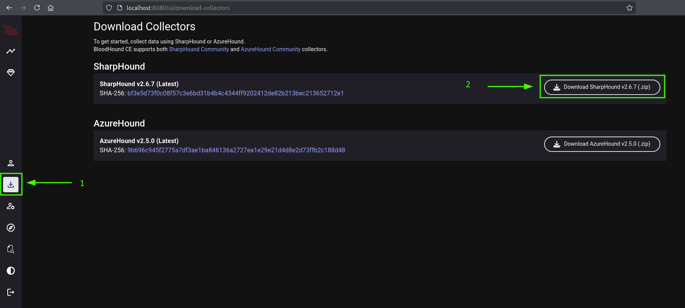
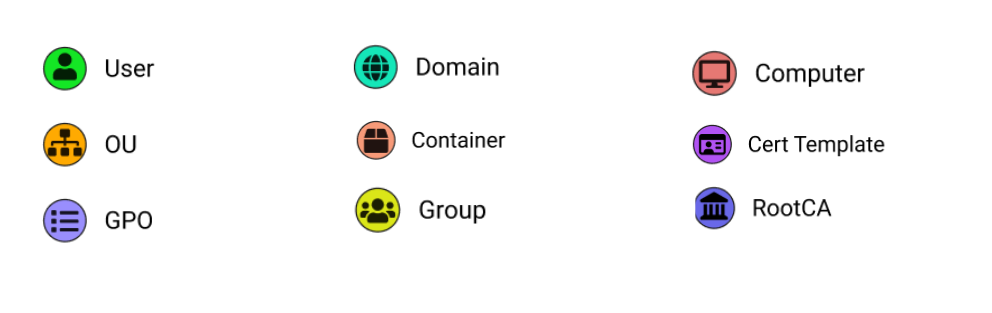
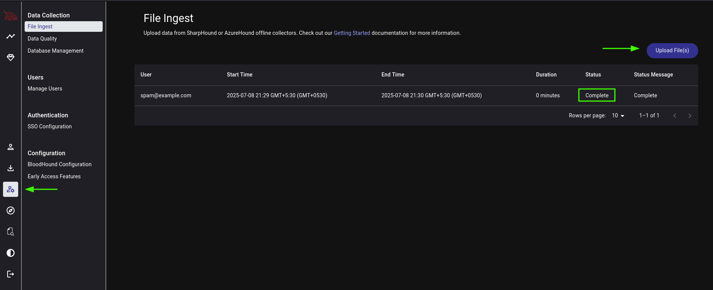
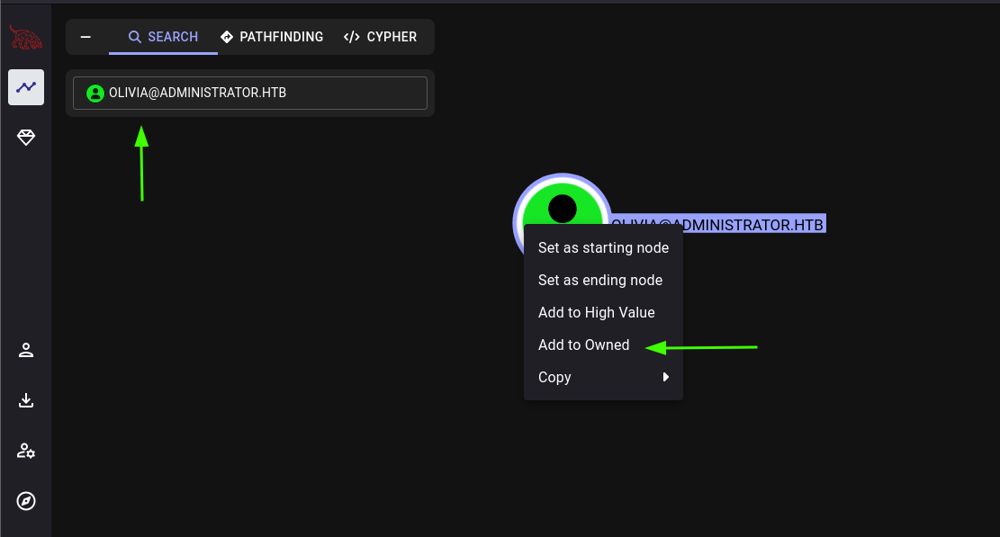
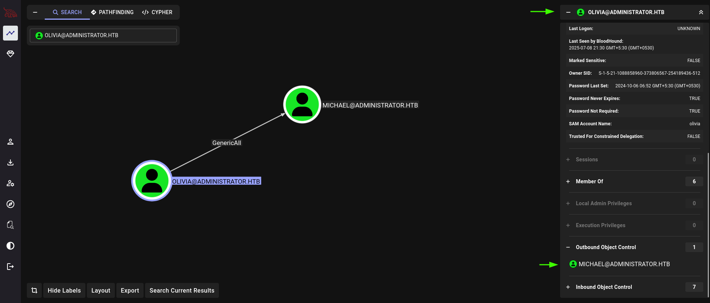
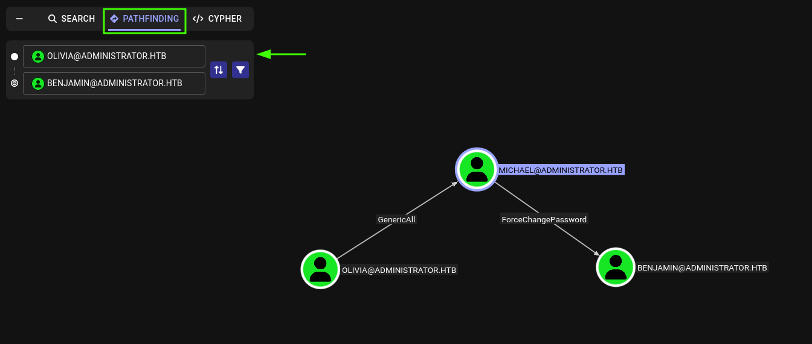
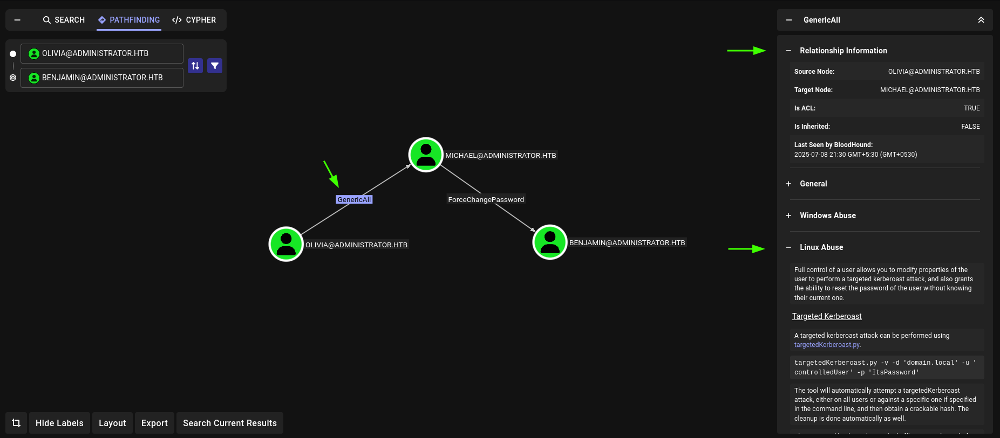
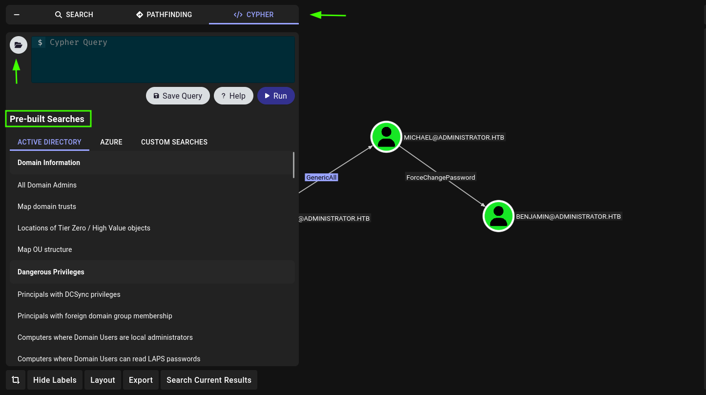
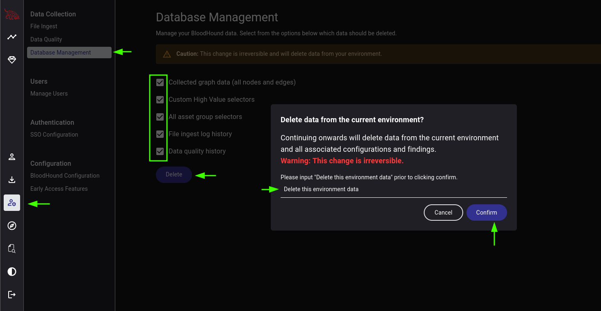

## What is Bloodhound ?
BloodHound, developed by SpecterOps, is a cybersecurity tool designed to analyze and manage identity-based attack paths within Active Directory (AD) and Azure environments. As mentioned on the official website of [SpecterOps](https://specterops.io/bloodhound-community-edition/), BloodHound uses graph theory to reveal the hidden and often unintended relationships within an Active Directory, Entra and Azure environment. Attackers can use BloodHound to easily identify highly complex Attack Paths that would otherwise be impossible to identify quickly, and defenders can use BloodHound to identify and eliminate those same Attack Paths. BloodHound helps blue and red teams better understand privileged relationships in an Active Directory, Entra, and Azure environments.
It comes in two versions: the open-source BloodHound Community Edition (CE) and the commercial BloodHound Enterprise (BHE).

**1. Bloodhound CE**

BloodHound CE is a free, open-source tool that utilizes graph theory to uncover hidden relationships and permissions within AD and Entra ID (formerly Azure AD). By mapping these relationships, it helps security professionals identify potential attack paths that adversaries might exploit. Both offensive (red teams) and defensive (blue teams) security practitioners use it to understand and mitigate privilege escalation risks. We will be using Bloodhound CE throughout this blog.

**2. BloodHound Enterprise**

BloodHound Enterprise is a commercial SaaS solution that builds upon the capabilities of the Community Edition. It offers continuous monitoring and advanced features to help organizations proactively manage and remediate identity-based attack paths in their hybrid environments.

## What are Ingestors ?
In BloodHound, ingestors (also called data collectors) are tools or scripts used to collect information from an Active Directory (AD) or Azure environment. This information is then ingested into BloodHound for analysis and graph visualization. There are basically 2 types of ingestors for bloodhound community edition: Sharphound and bloodhound-python. 

**1. Sharphound**
SharpHound Community Edition (CE) is the official data collector for BloodHound CE. It is written in C# and uses native Windows API functions and LDAP namespace functions to collect data from domain controllers and domain-joined Windows systems.

**2. bloodhound-python**
bloodhound-python is an open-source ingestor tool for BloodHound Community Edition, written entirely in Python. It is used primarily on Linux and macOS systems to gather Active Directory data for BloodHound remotely, especially in scenarios where tools like SharpHound (which is Windows/C#-based) cannot be used.

## Installing Bloodhound
For this blog we will be installing bloodhound community edition. The complete step for installation are provided in the official documentation on the [SpecterOps](https://bloodhound.specterops.io/get-started/quickstart/community-edition-quickstart) website. We will be installing it on Kali 2025.2 and it requires docker and docker-compose to work ([Official Installation Guide](https://www.kali.org/docs/containers/installing-docker-on-kali/)).

Docker & Docker-Compose can be installed on kali by following the following steps:
```bash
# Installing Docker
sudo apt update
sudo apt install -y docker.io
sudo systemctl enable docker --now
docker
sudo usermod -aG docker $USER

# Installing Docker-Compose
sudo apt-get install docker-compose
```

Reboot your system for docker daemon and other services to start.

Installing Bloohound CE:
Following the steps in the official [documentation](https://bloodhound.specterops.io/get-started/quickstart/community-edition-quickstart):

```bash
mkdir bloodhound && cd bloodhound

wget https://github.com/SpecterOps/bloodhound-cli/releases/latest/download/bloodhound-cli-linux-amd64.tar.gz

tar -xvzf bloodhound-cli-linux-amd64.tar.gz

./bloodhound-cli install
```



Now visit http://localhost:8080 in browser to access the bloodhound interface. Enter "admin" in email address field and the password provided in the terminal towards the end of the bloodhound-cli script output.
It will ask to reset the password, enter any password and Login.

## Installing the Ingestors
We need to download two ingestors for bloodhound: Sharphound and bloodhound-python

**1. Installing Sharphound**
Compatible version of sharphound can be downloaded from the bloodhound UI > Download Collectors.



Save it and extract it, you will find an executable file and powershell script file. Sharphound is used when you have the ability to execute commands on the target system such as winrm access or similar type of access as sharphound needs to be uploaded on the target system then it collects the data from the Active Directory environment.

**2. bloodhound-python**
bloodhound-python CE can be downloaded from the official github [repository](https://github.com/dirkjanm/BloodHound.py). As instructed in the installation process on the github repo we install bloodhound-python ce by:

```bash
pip install bloodhound-ce
```
And it can be accessed by running `bloodhound-ce-python` in the terminal.

## Setting up bash alias for easy access
Now, it's hectic to run bloodhound by always going into the installation directory and running docker-compose to start bloodhound. So we will create bash aliases for starting, stopping bloodhound and one for bloodhound-python so that we don't have to type bloodhound-ce-python every time and since bloodhound-python (legacy version) is installed by default in kali, we dont want to uninstall it and break any packages so let's just override it by creating a bash alias. Add the following in your `~/.zshrc` or `~/.bashrc` file:

```bash
alias bloodhound="docker compose -f /path/to/bloodhound/docker-compose.yml up -d"

alias bloodhound-stop="docker compose -f /path/to/bloodhound/docker-compose.yml stop"

alias bloodhound-python="bloodhound-ce-python"
```

- bloodhound : starts bloodhound
- bloodhound-stop : stop bloodhound
- bloodhound-python : run bloodhound-python CE

## Collecting data using Ingestors
There are various ways to collect data for bloodhound using the ingestors sharphound and bloodhound-python:

#### Using Sharphound
The first step of using sharphound to collect data is uploading it to the target system. There are various ways to do this, using a python http web server or upload it directly if you're using evil-winrm. Once it's uploaded use the following command to collect data:

```
.\SharpHound.exe -c All -d <domain> --zipfilename loot.zip
```

The same can be done with the powershell script if the `.exe` does not work, upload the SharpHound.ps1 file to the target system and run it by running the following commands:

```
# Import the script
. .\SharpHound.ps1

Invoke-Bloodhound -c All -d <domain> --zipfilename loot.zip
```
#### Using bloodhound-python
bloodhound-python can be used when we dont have remote access to the target system and its not possible to upload the sharphound binary onto the system. Or when we have an initial credential provided (in case of an assumed breach scenario) its generally good practice to run bloodhound-python first:

```bash
bloodhound-python -u "<username>" -p "<password>" -d <parent domain> -v --zip -c All -ns <target ip>
```

#### Extra: Using Netexec
Netexec can also be used for collecting data for bloodhound.

```bash
nxc ldap <ip> -u <user> -p <pass> --bloodhound --collection All --dns-server <target ip>
```

## Common Nodes and Edges Explained
Now before we start using bloodhound, its important to understand the common nodes and edges in bloodhound so that you know what and where to look at when mapping attack paths with bloodhound.

#### Common Nodes



Complete list of nodes can be found in the official [documentation](https://bloodhound.specterops.io/resources/nodes/overview) at SpecterOps.

#### Common Edges

Edges are the arrow-like shapes that connect two nodes together, each edge is labeled with something showing the permissions/privileges or other properties that one node has over another. Some of the interesting edges that you might want to look out for are:

- **GenericAll** – Grants full control over the object, allowing actions like adding users to a group or resetting a user’s password.
- **GenericWrite** – Allows modification of the object’s attributes, such as changing the logon script.
- **WriteOwner** – Lets the attacker change the object’s ownership to a user they control, effectively taking over the object.
- **WriteDACL** – Permits editing of the object’s access control list (ACL), enabling the attacker to assign themselves full permissions.
- **AllExtendedRights** – Includes privileges such as adding users to groups or resetting passwords.
- **ForceChangePassword** – Enables password changes for a user account without needing to know the current password.
- **DCSync** – Grants the ability to replicate domain controller data, which can be used to extract credentials from the domain.

Complete list of edges can be found in the official [documentation](https://bloodhound.specterops.io/resources/edges/overview).

## Mapping Attack Paths with Bloodhound
For this blog I will be using a retired machine from HackTheBox: [Administrator](https://app.hackthebox.com/machines/634)

#### Collecting Data and Uploading it to Bloodhound
This machine has an assumed breach scenario so we are already provided with a credential: `Olivia::ichliebedich`. We use the provided credential with bloodhound-python to gather data for bloodhound:

```bash
bloodhound-python -u 'Olivia' -p 'ichliebedich' -c All -d administrator.htb -ns 10.10.11.42 --zip
```
Now open bloodhound by visiting: http://localhost:8000/ and logging in using `admin:<your_password>`. And go to **Administration** from the side menu and click on upload files and then select the zip file created by bloodhound-python. And wait for a while till the status changes to Complete from Ingesting.



#### The Bloodhound Explorer
Now go to the **Explorer** from the side menu and search the user (Olivia) that we have credential for and select the user. This will bring the user object into the main screen, now select the Olivia user object, right click on it and select **Add to Owned**. Adding objects to owned helps bloodhound figure out more accurate attack paths compared to non-owned objects. It's always a good practice to add objects to owned if you have them compromised.



#### Outbound Object Control
Now next steps is to check the **Outbound Object Control** of the selected object. Outbound Object Control means which objects our user can control or have privilege over. This can be found on the right side of the bloodhound ui after selecting the object under **Object Information** and scrolling down. Selecting Outbound Object Control will show us the privilege that our user has over the other object by connecting them with an edge. Our user olivia has **GenericAll** privilege over user Michael. GenericAll means that we have full control over the target object. 



#### Pathfinding
Now we know that we have complete control over user Michael, so next we check the outbound object control of user michael and find that Michael has **ForceChangePassword** privilege over use benjamin. We can see this complete attack path by going to Pathfinding next to where we searched our user olivia and entering Olivia in the start node input field and Benjamin in destination node. This will show us the complete path from our user olivia to benjamin.



#### Relationship Information and Inbuilt Abuse Suggester
Now bloodhound also tells us the tools and commands we need to run to abuse these privileges mentioned on the edges. We can access that information by clicking on the edge and then check the Relationship Information on the right side of the bloodhound UI. Expanding the various subsections gives us information on how we can abuse the privilege on various systems. Since we do not have access to the target machine yet we will check the Linux abuse section. This gives us information about various tools, methods and commands that we can use to exploit that privilege.



## Bloodhound Cypher
In BloodHound, Cypher is the query language used to interact with the Neo4j graph database, which stores all of the data BloodHound collects about an Active Directory (AD) environment. Cypher allows you to write custom queries to explore Active Directory relationships in detail. It helps find hidden attack paths, over-privileged accounts, and misconfigurations by analyzing complex connections between users, groups, and computers. Since it's optimized for graph data, Cypher is fast and scalable, making it ideal for both red and blue team assessments.

We can access Cypher by clicking on Cypher at the top, its right beside pathfinding along with search. Cypher contains a lot of presets by default that we can use for advanced mapping and it can be accessed by clicking the little folder icon.



We can also use our own Cypher query, check out this [documentation](https://bloodhound.specterops.io/analyze-data/bloodhound-gui/cypher-search#what-is-cypher) by SpecterOps for further reference on how to use cypher in bloodhound.

## Deleting Data from Bloodhound
If you want to delete your ingested bloodhound data once you are done with your work so that it does not conflict with other data that you add into bloodhound in future, access Administration from the side menu and then select **Database Management**, here select all the checkboxes and click delete, it will prompt you to input a keyword, after inputting that keyword select delete and wait for a while, the ingested data will be deleted from bloodhound database.



## Conclusion
In this blog, we discussed the introduction to bloodhound, data collectors or ingestors, installing bloodhound on kali linux, installing ingestors, collecting data using various ingestors like sharphound, bloodhound-python and netexec. We also learned about common nodes and edges in bloodhound. Then we looked at a little example on how to use bloodhound and all the main components of bloodhound like the search functionality, pathfinding and cypher. And we looked at what to look out for when going through data in bloodhound i.e. Outbound Object Control. Deleting data from bloodhound once we are done with our work.